# SOC Threat Monitoring & Incident Response Lab


## Overview

This project demonstrates hands-on experience in building and operating a Security Operations Center (SOC) Home Lab using Wazuh SIEM, Suricata IDS, Kali Linux, and Ubuntu Server.

The objective of this project was to simulate real-world cyber attacks, monitor security events, investigate alerts, perform threat hunting activities, and execute incident response procedures within a controlled lab environment.

This project showcases:

* SIEM Deployment and Administration
* Endpoint Security Monitoring
* Network Intrusion Detection
* Threat Detection and Analysis
* Threat Hunting
* SSH Brute Force Detection
* Incident Investigation
* Incident Response and Containment
* MITRE ATT&CK Mapping

---

# Project Information

## Environment

| Component        | Details             |
| ---------------- | ------------------- |
| SIEM Platform    | Wazuh 4.x           |
| IDS Solution     | Suricata IDS        |
| Attacker Machine | Kali Linux          |
| Victim Machine   | Ubuntu Server 26.04 |
| Monitoring Agent | Wazuh Agent         |
| Attack Tools     | Hydra, Nmap         |
| Firewall         | UFW                 |
| Framework        | MITRE ATT&CK        |

---

# Lab Architecture

```text
Kali Linux (Attacker)
        |
        |
        v
Ubuntu Server (Victim)
├── Wazuh Agent
└── Suricata IDS
        |
        |
        v
Wazuh Server
├── Wazuh Manager
├── Wazuh Indexer
└── Wazuh Dashboard
```

## Screenshot

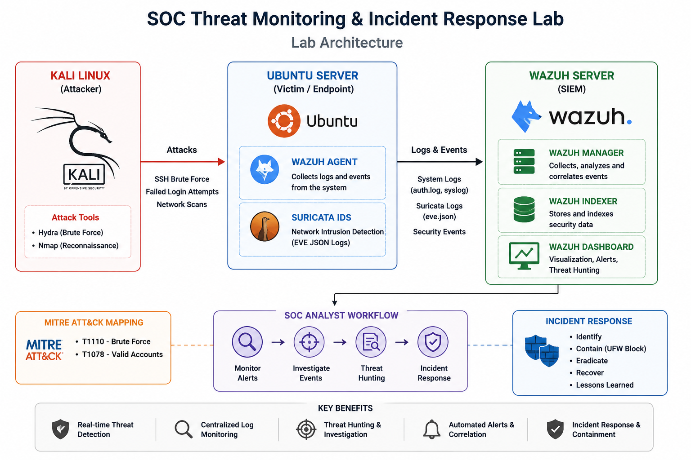

---

# Skills Demonstrated

## Security Operations Center (SOC)

* Security Monitoring
* Alert Triage
* Threat Hunting
* Incident Investigation
* Incident Response

## SIEM Engineering

* Wazuh Deployment
* Agent Management
* Log Collection
* Event Correlation

## Network Security

* Intrusion Detection Systems (IDS)
* Network Monitoring
* Attack Detection

## Linux Administration

* Service Management
* Firewall Configuration
* Log Analysis
* Security Monitoring

---

# Step 1 – Deploy Wazuh Server

Installed and configured the Wazuh Server.

Components Installed:

* Wazuh Manager
* Wazuh Indexer
* Wazuh Dashboard

## Verification

```bash
sudo systemctl status wazuh-manager
sudo systemctl status wazuh-indexer
sudo systemctl status wazuh-dashboard
```

## Screenshot

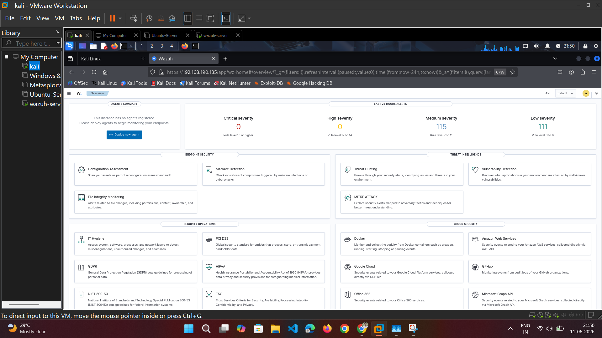

---

# Step 2 – Deploy Wazuh Agent

Installed and configured the Wazuh Agent on the Ubuntu victim machine.

## Verification

```bash
sudo systemctl status wazuh-agent
```

The agent successfully connected to the Wazuh Server.
## Screenshot agent running

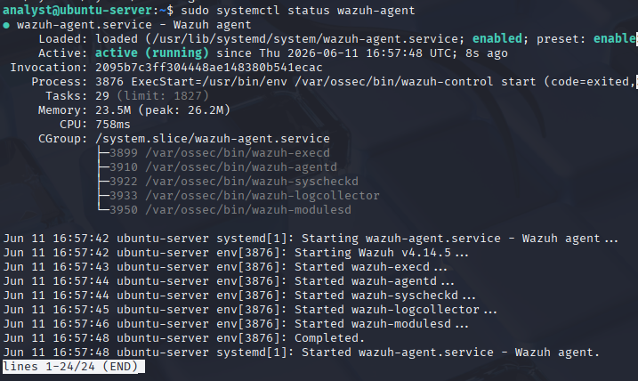

## Screenshot agent deploy

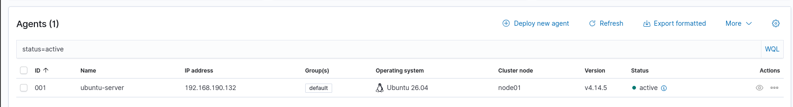

---

# Step 3 – Install Suricata IDS

Installed Suricata IDS on the Ubuntu victim machine.

## Installation

```bash
sudo apt update
sudo apt install suricata -y
```

## Verification

```bash
sudo systemctl status suricata
```

## Screenshot

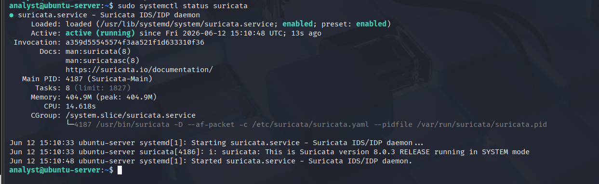

---

# Step 4 – Integrate Suricata with Wazuh

Configured Wazuh Agent to monitor Suricata Eve JSON logs.

Configuration File:

```text
/var/ossec/etc/ossec.conf
```

Added:

```xml
<localfile>
  <log_format>json</log_format>
  <location>/var/log/suricata/eve.json</location>
</localfile>
```

Restarted Agent:

```bash
sudo systemctl restart wazuh-agent
```

## Verification

```bash
sudo tail -20 /var/ossec/logs/ossec.log
```

Observed:

```text
Analyzing file:
/var/log/suricata/eve.json
```

---

# Step 5 – Generate SSH Brute Force Attack

A brute-force attack was simulated using Hydra from Kali Linux.

## Attack Command

```bash

hydra -l analyst -P password.txt ssh://192.168.190.132

```

## Objective

* Generate authentication failures
* Trigger security alerts
* Validate monitoring capabilities

## Screenshot

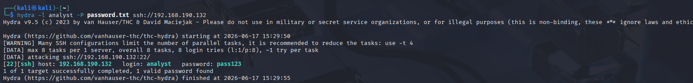

---

# Step 6 – Verify Authentication Logs

Validated that SSH authentication events were generated on the Ubuntu victim machine.

## Verification

```bash
sudo tail -20 /var/log/auth.log
```

Observed:

```text
Failed password for analyst
Maximum authentication attempts exceeded
```

## Investigation Insight

These logs confirmed that the brute-force attack successfully generated security events on the endpoint.
## Screenshot

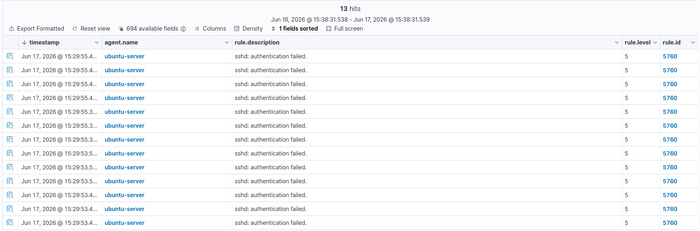

multiple authentication failures followed by success

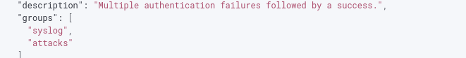

---

# Step 7 – Threat Hunting Investigation

Investigated authentication alerts using Wazuh Threat Hunting.

## Findings

### Source IP

```text
192.168.190.128
```

### Target Host

```text
192.168.190.132
```

### Username

```text
analyst
```

### Event Type

```text
SSH Authentication Failure
```

## Screenshot

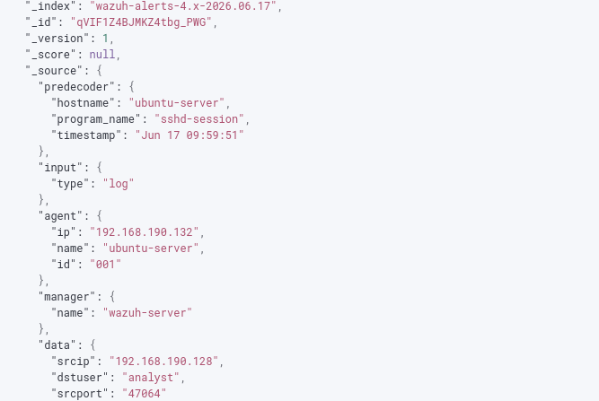

---

# Step 8 – MITRE ATT&CK Mapping

Wazuh successfully mapped the attack to MITRE ATT&CK techniques.

| Technique ID | Technique      |
| ------------ | -------------- |
| T1110        | Brute Force    |
| T1078        | Valid Accounts |

## Screenshot

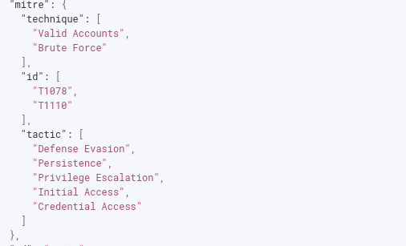

---

# Step 9 – Incident Response

Performed containment actions after identifying the malicious source IP.

## Block Attacker IP

```bash
sudo ufw deny from 192.168.190.128
```

## Verification

```bash
sudo ufw status
```

Result:

```text
Anywhere DENY 192.168.190.128
```

## Screenshot

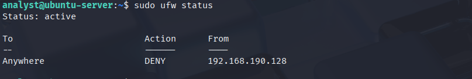
<!--
---

# Project Evidence

## Wazuh Dashboard


## Agent Connected


## Suricata IDS


## Hydra Attack


## Authentication Alert


## Threat Hunting


## MITRE ATT&CK Mapping


## Incident Response


--- 
-->

# Detection Workflow

```text
Hydra Attack
      |
      v
Ubuntu SSH Service
      |
      v
Authentication Logs
      |
      v
Wazuh Agent
      |
      v
Wazuh Manager
      |
      v
Wazuh Dashboard
      |
      v
Threat Hunting Investigation
      |
      v
Incident Response
```

---

# Key Security Events Observed

* SSH Authentication Failures
* Successful Authentication Events
* PAM Authentication Logs
* SSH Session Activity
* Threat Hunting Alerts
* MITRE ATT&CK Correlation

---

# What I Learned

Through this project, I gained practical experience in:

* SIEM Deployment and Administration
* Wazuh Agent Management
* Suricata IDS Integration
* Security Monitoring
* Threat Detection
* Log Analysis
* Threat Hunting
* Incident Investigation
* Incident Response
* MITRE ATT&CK Mapping

---

# Future Improvements

Planned enhancements:

* Nmap Reconnaissance Detection
* File Integrity Monitoring (FIM)
* Active Response Automation
* Windows Endpoint Integration
* Email Alerting
* Custom Detection Rules
* Multi-Endpoint Monitoring

---

# Author

**Lavanya Kumar Batchu**

B.Tech CSE | Cybersecurity Enthusiast | SOC Analyst Aspirant

